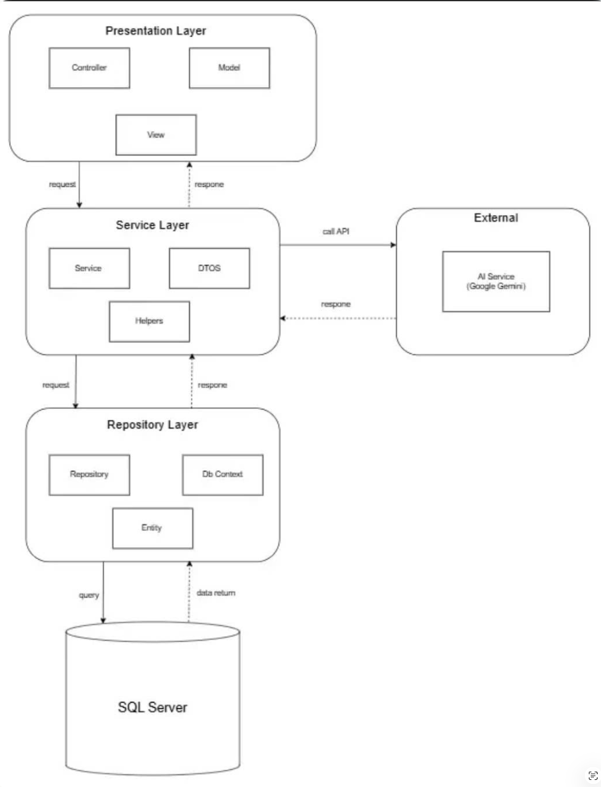

# PRN222_10W_Assignment1

ASP.NET Core MVC app with layered architecture (Repository → Service → Presentation).

## Technical documentation

The complete Vietnamese technical handbook is available at:

- [Documentation center](docs/README.md)
- [Architecture handbook](docs/ARCHITECTURE_HANDBOOK.md)
- [Database reference](docs/DATABASE_REFERENCE.md)
- [AI, Quiz and learning guide](docs/AI_QUIZ_AND_LEARNING_GUIDE.md)
- [Security and HTTP guide](docs/SECURITY_AND_HTTP_GUIDE.md)
- [Operations runbook](docs/OPERATIONS_RUNBOOK.md)
- [Testing and QA playbook](docs/TESTING_AND_QA_PLAYBOOK.md)
- [UI/UX design system](docs/UI_UX_DESIGN_SYSTEM.md)
- [Developer onboarding](docs/DEVELOPER_ONBOARDING.md)

# Setup

Clone the repository.                                                                                                                                            

### Database Setup
                                                                                                     
   Create Database from SQL Script                                                                      
   A SQL script is provided in:                                                                
   Scripts/CreateDB.sql                                                                      

   Step 1: Create Database
   Open SQL Server Management Studio and run:
   CREATE DATABASE Assignment1DB;

   Step 2: Select Database
   USE Assignment1DB;                                                                                                                                                                                                                      

   Step 3: Execute Script
   Run:
   Scripts/CreateDB.sql

### Configure Connection String                                                                                                                                                                                                                                                                                                                                      
Copy the template file:
   ```bash
   copy Assignmet1_Presentation\appsettings.example.json Assignmet1_Presentation\appsettings.json
   ```                                                                                                                                    
Update:
Edit `Assignmet1_Presentation/appsettings.json` with your local `DefaultConnection`.
For Windows Authentication:                                                                                                                                     

{
"ConnectionStrings": {
"DefaultConnection": "Server=localhost;Database=Assignment1DB;Trusted_Connection=True;TrustServerCertificate=True;"
}
}
                                                                                                                                                                 
Run the presentation project:                                                                                                                                         

   ```bash
   dotnet run --project Assignmet1_Presentation
   ```

`appsettings.json` is not committed to Git — use `appsettings.example.json` as a template.

# System Architecture



The application follows a layered architecture to ensure separation of concerns and maintainability.

Presentation Layer                                                                                 

Responsible for:
* Handling HTTP requests                                                                                                            
* Displaying views                                                                                                                                           
* User interaction
                                                                                       
Components:

* Controllers
* Views
* ViewModels

Service Layer

Responsible for:
* Business logic
* Data validation
* Communication with external AI services
Components:
* Services
* DTOs
* Helpers

Repository Layer
Responsible for:
* Data access                                                                                                         
* CRUD operations                                                                                                                                                                   
* Database interaction through Entity Framework                                                    Core                                                                                                          
Components:                                                                                                                                                                                         
* Repositories                                                                                               
* Entities                                                                                                                                                                                                              
* DbContext                                                                                                                                    


                                                                                                                      


                                                                                                                                                                                      


                                                                                                                        


                                                                                                                          


                                                                                                                       


                                                                                                                     
                                                                                                                              


                                                                                                                             


                                                                                                                                  


                                                                                                                                                                                    


                                                                                                                                                                      


                                                                                                       


                                                                              


